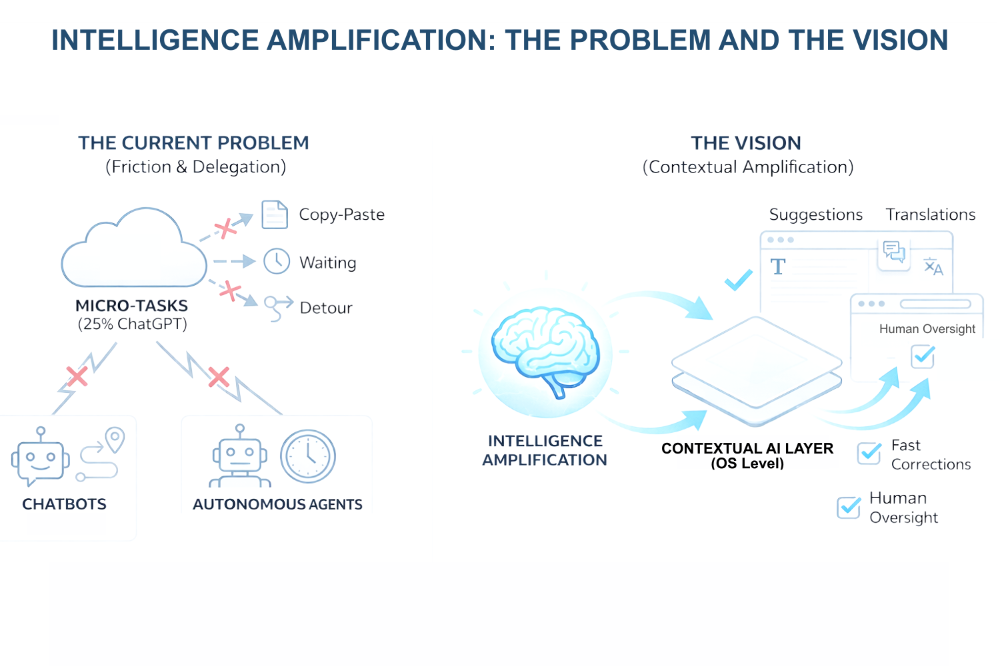

# Verbe - Intelligence Amplification for macOS

## Inspiration

Two observations collided:

**1. The friction problem is real.** A New York Times study found that 25% of ChatGPT usage is just translation and typo fixes. Micro-tasks. But for a micro-task, the workflow is broken: open a tab, copy text, paste into chat, wait, copy result, switch back, paste. That's 7 steps for a 2-second task. Most people just... don't bother.

**2. The AI landscape has a gap.** On one side, chatbots - you go to them, you wait, you copy-paste back. It's a detour. On the other side, autonomous agents - they work without you, you discover results later. It's delegation. Neither felt right for how we actually work: fast, contextual, in control.

We wanted something different. Not an app you open. Not a bot you talk to. A **layer** - always there, always ready, always instant.

The term **"Intelligence Amplification"** was coined by Douglas Engelbart in 1962. He imagined technology that extends human capability rather than replacing it.

Sixty years later, that vision is still being actively debated in product choices. Much of the current momentum is pushing toward **autonomous agents** - systems designed to act on behalf of users, outside their immediate flow. Tools like **OpenClaw**, **Claude CoWork**, and **OpenAI Frontier** frame AI as a delegated collaborator: you hand off work, and check back later. Powerful, but fundamentally asynchronous and detached from the moment of action.

At the same time, a different signal is emerging. Recently, the **Chrome Built-in AI team at Google** presented **WebMCP**, a set of early preview APIs that let websites expose explicit, real-time actions to AI systems. Instead of agents guessing how to operate an interface, sites can declaratively define what can be done - while the user is present, in the browser, inside the workflow.

In parallel, **AG-UI** explores a similar direction: standardizing how AI systems and user interfaces communicate in real time, at the interaction layer. Not backend orchestration, not long-running delegation - but AI operating directly alongside the human, responding to what's on screen, in context.

Together, these signals point to a clear tension in the landscape: **delegation versus amplification**. AI that works instead of you - versus AI that works with you, at the moment work is happening.

**Verbe takes a clear stance.** Not an agent you send away, but the ambition to be the intelligence layer that stays with you - instant, contextual, and under your control - extending human capability exactly where attention and decisions already live. Bring this augmentation down to the operating-system level, unifying context across apps into a single, user-centric layer, for real-time assistance and instant feedback by amplifying the human at work, rather than replacing them.



## What it does

Verbe is an intelligence layer that sits on top of macOS. It works in any app - Mail, Slack, Figma, Chrome, Notion, WhatsApp, VS Code - with the same two gestures:

- **`Cmd+Opt`** → Text input (use shortcut or type what you want)
- **`Fn`** → Voice command (say what you want)
- **`Fn+Shift`** → Live conversation (conversation with Gemini)

The result appears as an **overlay**, a floating panel right where you're working. You decide what to do with it: insert, copy, or dismiss.

### Core Features

**Screen as Context**
When activated, Gemini sees what you select - or your entire screen if no text is selected. No need to explain, copy, or describe. Looking at an email? Say "reply yes but suggest Thursday." Looking at a chart? Say "why is this dropping." Looking at code? Say "what's wrong here." Gemini's vision capability turns your screen into the prompt.

**Recipes**
Repeatable intentions. A recipe is a transformation template you save and reuse. "Professional" rewrites any text formally. "First Principles" analyzes any design through fundamental needs. "Explain Like Mom" simplifies anything. Same recipe, different content, always adapted. Create new recipes by just describing what you want in natural language.

**Zero-Friction Ergonomics**
Every interaction is designed to minimize hand movement and cognitive load. `Cmd+Opt` is a hold-and-release gesture - hold to show the radial menu, move your mouse to pick a recipe, release to dismiss. No clicking through menus, no switching windows. The overlay appears at your cursor so your eyes stay where they are. The entire flow - from intent to result - happens without leaving your current app or lifting your hands off the keyboard.

**Streaming Responses**
Gemini 3 Flash Preview streams results token by token directly into the overlay. You start reading before the response is complete. No spinner, no waiting for a full answer - the output builds in front of you in real time. When feedback is instant, you stay in flow. When it's slow, your brain moves on.

**Image Generation**
Some recipes generate images instead of text. Describe what you need - a diagram, a mockup, an illustration - and Gemini produces it directly in the overlay. No need to open a separate tool or bounce between apps.

**Voice Command**
Hold `Fn` to give a one-shot voice instruction. Verbe records while you hold, then sends the audio to Gemini when you release - like a walkie-talkie. "Translate this to Spanish." "Summarize this page." Quick, hands-free, no typing required.

**Voice Live Mode**
Hold `Fn` + `Shift` for a bidirectional conversation with Gemini. Brainstorm, debug, think out loud. Interrupt anytime - you're always in control. The AI doesn't monologue; it collaborates. Audio streams both ways in real time.

**Non-Intrusive Overlay**
The overlay floats above your work as a transparent panel that never steals focus. You can keep typing in your app while the response streams in. macOS 26 Liquid Glass gives it a native, non-obtrusive feel. Insert the result, copy it, or dismiss it - your workflow is never hijacked.

## How we built it

### Architecture

```
┌─────────────────────────────────────────────────┐
│                   macOS App                     │
├─────────────────────────────────────────────────┤
│  Hotkey Listener    │    Accessibility API      │
│  (Cmd+Opt / Fn)     │    (selected text, app)   │
├─────────────────────────────────────────────────┤
│              Screen Capture (Vision)            │
├─────────────────────────────────────────────────┤
│                  Context Builder                │
│   (app name + selection + screen + intent)      │
├─────────────────────────────────────────────────┤
│               Gemini 3 Flash API                │
│      (multimodal: text + vision + audio)        │
├─────────────────────────────────────────────────┤
│                 Overlay Renderer                │
│     (NSPanel, .accessory level, no focus)       │
└─────────────────────────────────────────────────┘
```

**Swift + AppKit** for the native macOS experience. The overlay system uses `NSPanel` with `.accessory` window level - it floats above apps without stealing focus. This is crucial: Verbe should never interrupt your work.

**Accessibility API** captures selected text and identifies the active application before the overlay appears. This ordering is critical - once our app activates, the source app loses its selection.

**Screen Capture** sends the visible screen to Gemini when no text is selected. This enables vision-based queries: "analyze this design," "what's wrong here," "explain this chart."

**Gemini 3 Flash** handles all AI processing with streaming responses. Multimodal input (text + image + audio) goes in, streamed response comes out. Speed depends on the model, but streaming means you start reading immediately.

**Live Audio Streaming** for Voice Live mode uses Gemini's real-time API. The conversation is truly bidirectional - you can interrupt, redirect, or end at any moment.

### The Overlay System

The overlay is the heart of Verbe. Design constraints:

1. **Never steal focus** - you should be able to keep typing in your app
2. **Appear at cursor** - minimal eye movement
3. **Actionable** - Insert, Copy, or dismiss with one click
4. **Dismissable** - release the hotkey or click outside

The overlay uses macOS 26's Liquid Glass aesthetic - semi-transparent, blurred background, fully native feel. Getting an `NSPanel` to float above all apps, accept keyboard input, yet never steal focus from the underlying application was the hardest UI challenge of the project.

## Challenges we ran into

**1. Focus management is hard.**
macOS really wants windows to steal focus. Making an overlay that appears, accepts clicks, but doesn't take focus from the underlying app required deep diving into `NSPanel` behavior, window levels, and activation policies. The app runs as `.accessory` (no Dock, no Cmd-Tab) and the overlay is a `nonactivatingPanel` - getting every combination of `canBecomeKey`, `canBecomeMain`, `hidesOnDeactivate`, and `collectionBehavior` right was a long process.

**2. The capture-before-UI invariant.**
Selected text only exists while the source app has focus. The moment our overlay appears, the source app loses focus and the selection is gone. We had to enforce a strict ordering: capture text first (via Accessibility API or clipboard fallback), store it, then show the overlay. Breaking this ordering even once means losing the user's text with no way to recover it.

**3. Voice input UX is tricky.**
When does "I'm done talking" happen? We considered silence detection (frustrating - pauses are natural) and explicit end words (awkward). Button release won. `Fn`-release feels natural - like a walkie-talkie. Hold to talk, release to send.

**4. Recipe system design.**
How do you make something powerful yet simple? We iterated on the recipe editor until it came down to: name, icon, and a natural language instruction. That's it. Power users can toggle vision or image generation modes, but everyone else just describes what they want in plain text.

**5. Cross-app text insertion.**
Getting text back into the source app is harder than getting it out. We use a clipboard-based approach: write to pasteboard, simulate Cmd+V, then restore the original clipboard contents. It works reliably across most apps, but timing matters - some apps (especially Electron-based ones) need a small delay before the paste event registers.

## Accomplishments that we're proud of

**It actually works across apps.** Same gesture, same overlay, whether you're in Mail, Slack, VS Code, Safari, Notion, or Terminal. The app is invisible until you need it, then it's right there.

**Streaming feels right.** Responses start appearing immediately. You're reading the first line while the rest is still generating. It removes the "waiting" feeling entirely.

**The recipe system.** Creating a recipe by describing "transform my messy notes into action items with deadlines" and then using it seconds later on any text, anywhere - that moment of "wait, it just works?" is what we were aiming for.

**Voice Live conversations.** Having a real-time bidirectional conversation with Gemini while looking at your screen - brainstorming, interrupting when you've got the answer, seeing it flow naturally - this is the interaction model we believe in.

**Image generation in context.** Selecting a text description and having an image appear right in the overlay, without opening any other app, feels like a genuine workflow improvement.

## What we learned

**Streaming changes the perception of speed.** The model's response time is out of our control. But streaming means the user starts reading immediately. The perceived latency drops dramatically - and that's what determines whether the tool feels usable or frustrating.

**Context eliminates prompting.** When the AI can see your screen, you don't need to explain. "Fix this" works when "this" is visible. This is the unlock that makes a 3-word input powerful.

**Control beats automation.** People don't want AI to do things for them. They want AI to do things _with_ them. Showing the result before acting, letting users edit, making every action explicit - that's trust.

**Recipes are personal.** The best recipes aren't generic ("Summarize"). They're specific ("Explain this like I would to my mom" or "Analyze through first principles"). Verbe becomes more valuable the more you customize it.

## What's next for Verbe

**Immediate (next 4 weeks):**

- Code stabilization
- Rework / Improvment on the UI

**Short-term (next 2 months):**

- Public beta for macOS
- Recipe chaining (output of one => input of another)
- Integrations: Calendar (create events), Reminders, Notion API
- Recipe sharing - export/import your recipes
- More overlay types: tables, forms, images
- Web Search
- Apple Shortcuts support

**Long-term vision:**

- Connect More Powerful AI Tool in Verbe
  - On-device AI for small llm generation/privacy
  - Async Cloud custom agent for big tasks
  - AI workflow for recipes
  - Implement more protocol, features like WebMCP, AGUI protocol, MCP or skills stores
- iOS companion (capture on phone, process on Mac)
- Team recipes (shared within organizations)
- Local model option for privacy-sensitive workflows
- Lot of stuffs ...

We believe the future of AI interaction isn't chat windows or autonomous agents. It's augmentation - intelligence that extends what you can do, right where you're doing it.

Verbe is the fastest road from thought to result.

## Built With

- Swift + AppKit + SwiftUI
- Gemini 3 Flash Preview API (text + vision + image generation)
- Gemini 2.5 Flash Native Audio Preview API (voice live)
- macOS Accessibility API + ScreenCaptureKit
- macOS 26 Liquid Glass

Made by Yafa
Twitter: @YafaHodis
